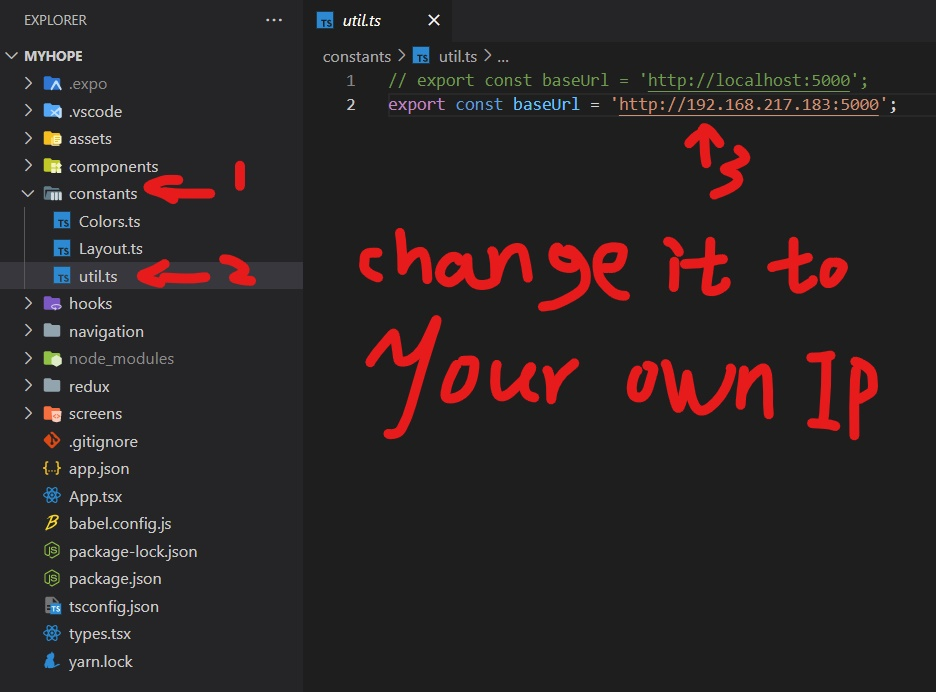
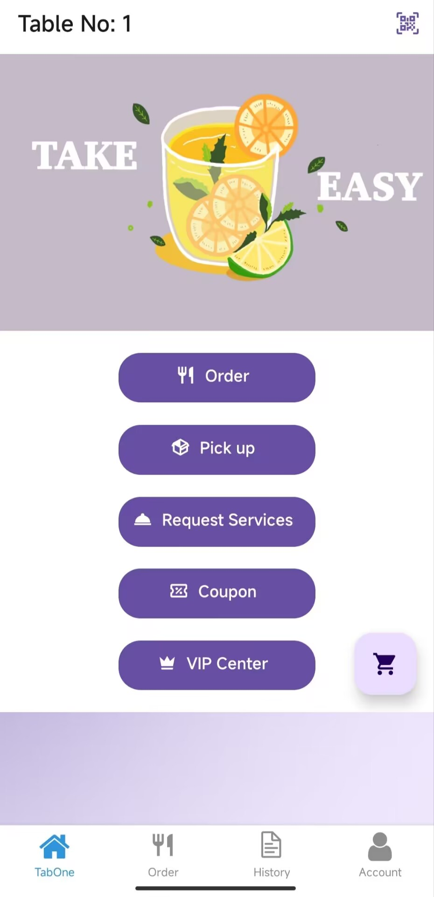

# Group 45 Self-Service-Ordering -- Customer Pages
This is the final project for the IT5003C and IT5004C at the University of Cincinnati in 2022-2023 semester

## The steps to connect the mobile end and the backend

### How to start the Customer (Android) end: expo start

Please follow the steps below the picture to config the IP address.

Step1: Be sure that the backend and the mobile end are in the same LAN (network).

Step2: Change the IP address in the code. The IP address should be same as your PC (backend LAN) IPv4 address.

## Homepage preview

